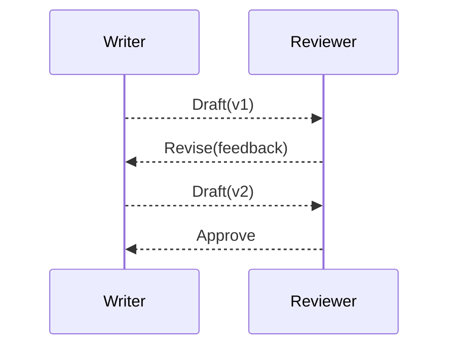

# Human review (/docs/learn/human-review)

# 5 — Human review

Participant kind and protocol role are different axes. The `Reviewer` role
can be played by a human today and a machine tomorrow; the endpoint contract
stays the same. This step swaps the Reviewer's implementation — not the
protocol.

The workflow grows a revision loop: the Reviewer can approve or send typed
feedback for another iteration.



## One protocol, two participants

```python compile
from openai import AsyncOpenAI

from agentsparty.agent import agent
from agentsparty.human import human, script
from agentsparty import OpenAIModel
from agentsparty.participant import says
from agentsparty.protocol import Nothing, Text, case, alt, msg, render
from agentsparty.kernel.role import roles
from agentsparty.runtime import Cast

Writer, Reviewer = roles('Writer', 'Reviewer')
# Reviewer can choose approval or send typed feedback for another iteration.
Draft = Text('Draft')
Approve = Nothing('Approve')
Revise = Text('Revise')
protocol = msg[Writer, Reviewer](Draft) >> alt[Reviewer, Writer](
    Approve, Revise
)
print(render(protocol))
# The OpenAI model authors the initial draft; the human selects Revise.
model = OpenAIModel('gpt-5.6-luna', AsyncOpenAI(max_retries=0))
trace = (
    # Both roles remain bound to the same projected protocol contract.
    Cast(protocol)
    .play(Writer, agent(model, 'draft'))
    .play(Reviewer, human(script(says(Revise, 'add numbers'))))
    .run_sync()
)
assert [e.label.name for e in trace] == ['Draft', 'Revise']
print([e.label.name for e in trace])
```

In a CLI session `human()` waits for input. In a test, `script()` supplies the
same role's alts deterministically. The runtime still checks the exact
projected endpoint, so swapping the participant does not bypass the protocol.

## The four participant kinds

| Kind | Factory | Use when |
| --- | --- | --- |
| Agent | `agent(model, instructions)` | An LLM authors content |
| Human | `human(io)` | A person is in the loop |
| Machine | `machine(decide)` | Deterministic code decides |
| Toolbox | `service(tool_for(...))` | Tools act as a role |

Every kind implements the same `select` / `offer` contract, so binding is
identical. The complete step is `docs/examples/tutorial/03_human_review.py`.

Next: [journal and resume](/docs/learn/journal-and-resume).

